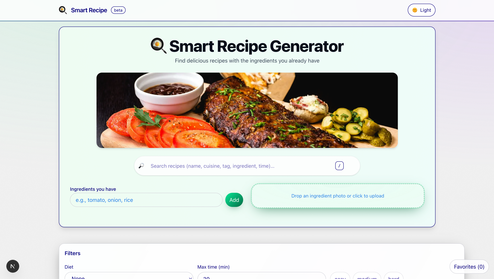

# 🍳 Smart Recipe Generator


Find delicious recipes using the ingredients you already have.  
Search by name, cuisine, tags, filter by diet & time, drop a photo of ingredients for recognition, and even generate a complete recipe with AI.

## Live WEBSITE - https://smart-recipe-generator-gamma.vercel.app/
## Github Link - https://github.com/sushobhitsaxena

---

## ✨ Features

### 1. User Input
- ✅ Allow users to input available ingredients (text input or selecting from a list).
- ✅ Option to specify dietary preferences (e.g., vegetarian, vegan, gluten-free).

### 2. Recipe Generation
- ✅ Generate recipes based on the provided ingredients.
- ✅ Suggest multiple recipes with detailed step-by-step instructions.
- ✅ Include nutritional information (calories, protein, fats, carbs).

### 3. Filters and Customization
- ✅ Filter recipes by difficulty, cooking time, or dietary restrictions.
- ✅ Option to adjust serving sizes dynamically.

### 4. Recipe Database
- ✅ Predefined recipe database with a variety of cuisines.
- ✅ Each recipe includes:
  - Ingredients  
  - Cooking steps  
  - Nutritional information  

### 5. User Feedback
- ✅ Users can **rate and save** their favorite recipes (favorites stored locally).
- ✅ “Recipe suggestions” feature based on ratings & preferences.

### 6. UI/UX
- ✅ Clean, intuitive interface for easy navigation.
- ✅ Mobile-responsive design for use on any device.
- ✅ Light/Dark theme with a glassy header.
- ✅ Keyboard shortcuts (e.g., `/` to focus search).

### 7. Hosting
- ✅ Free hosting with **Vercel**.  
- ✅ Live demo: [Smart Recipe Generator](https://smart-recipe-generator-3qli.vercel.app/)

---

## 🔑 Required Features Implemented
- Ingredient recognition from images (photo upload → normalize names).
- Recipe matching algorithm with **match scoring**.
- Substitution suggestions for missing ingredients.
- Dietary restrictions handling (vegetarian, vegan, gluten-free).
- Product database with **20+ recipes**.
- Live deployment (Vercel).
- Fully **mobile responsive** design.

---

## 🧮 Evaluation Criteria (Covered in Project)
- **Ingredient classification approach** → image-to-text recognition & normalization.  
- **Recipe matching logic** → scoring system based on ingredient availability & substitutions.  
- **Error handling** → fallbacks if ingredients not found, user-friendly messages.  
- **User experience** → simple UI, filters, responsive design, local storage for favorites.  

---

## 🚀 Tech Stack

### Frontend
- **Next.js 15** (App Router, Turbopack)
- **React 18**
- **TypeScript**
- **Tailwind CSS**

### UI
- Custom components
- Lucide icons
- Next.js Image component

### AI & Data
- **OpenAI (Chat Completions API)** → recipe generation
- Ingredient photo recognition with normalization dataset
- Local JSON/TS datasets + localStorage (for ratings/favorites)

---

## 📸 Demo



---

## 🛠 Getting Started

```bash
## 1️⃣ Clone the repo
git clone https://github.com/UDAY1810/smart-recipe-generator.git
cd smart-recipe-generator

## 2️⃣ Install dependencies
npm install

## 3️⃣ Set environment variables
# Create a .env.local file in the root folder and add:
OPENAI_API_KEY=your_openai_api_key

## 4️⃣ Run locally
npm run dev

# Now open → http://localhost:3000


📦 Deployment

Deployed on Vercel → https://smart-recipe-generator-gamma.vercel.app/


📜 License

Licensed under the MIT License.
Made with ❤️ by Uday Dubey